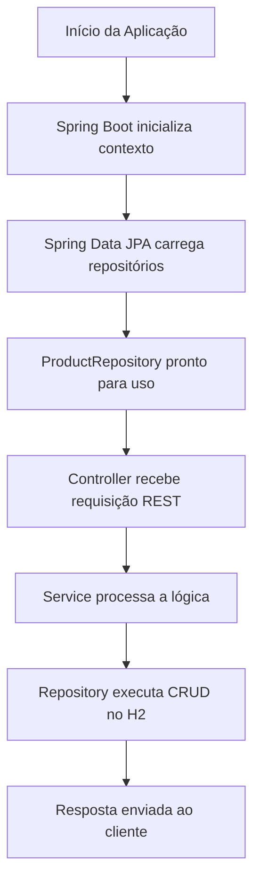

# 📦 Spring Data JPA Demo

Example project using Spring Boot, Spring Data JPA, and H2 in-memory database to demonstrate creating JPA repositories and simple CRUD operations.

## 🚀 Tecnologias Utilizadas

- Java 21
- Spring Boot 3
- Spring Data JPA
- H2 Database (banco em memória)
- Gradle
- REST API

## 📂 Estrutura de Pastas

```bash
spring-data-jpa-demo/
│── src/
│   ├── main/
│   │   ├── java/com/example/springdatajpa/
│   │   │   ├── SpringDataJpaDemoApplication.java   # Classe principal
│   │   │   ├── entity/Product.java                 # Entidade JPA
│   │   │   ├── repository/ProductRepository.java   # Interface JPA Repository
│   │   │   ├── service/ProductService.java         # Camada de serviço
│   │   │   └── controller/ProductController.java   # API REST
│   │   └── resources/
│   │       ├── application.yml                     # Configuração Spring Boot
│   │       └── data.sql                            # Dados iniciais
│── build.gradle
└── README.md
```

## ⚙️ Configuração

O projeto usa um banco H2 em memória, configurado no arquivo application.yml:

```yaml
spring:
  datasource:
    url: jdbc:h2:mem:testdb
    driverClassName: org.h2.Driver
    username: sa
    password:
  jpa:
    hibernate:
      ddl-auto: update
    show-sql: true
  h2:
    console:
      enabled: true
      path: /h2-console
```

## ▶️ Como Executar

1. Clonar o repositório

```bash
git clone https://github.com/seu-usuario/spring-data-jpa-demo.git
```

2. Entrar no diretório

```bash
cd spring-data-jpa-demo
```

3. Rodar o projeto

```bash
./gradlew bootRun
```

## 🌐 Endpoints

| Método |	Endpoint |	Descrição |
|-------|----------|----------|
| GET |	/products |	Lista todos os produtos |
| POST |	/products |	Adiciona um novo produto

### Exemplo de POST

```json
{
  "name": "Monitor",
  "price": 900.00
}
```

## 🗺 Fluxograma do Projeto



## 📚 Conceitos Demonstrados
- Criação de entidades JPA (@Entity)
- Repositórios Spring Data (JpaRepository)
- Camada de serviço para regras de negócio
- Banco de dados em memória H2
- Configuração via application.yml
- Inicialização de dados com data.sql
- Exposição de API REST com @RestController


