# 📦 Spring Data JPA Demo

Example project using Spring Boot, Spring Data JPA, and H2 in-memory database to demonstrate creating JPA repositories and simple CRUD operations.

## 🚀 Technologies Used

- Java 21
- Spring Boot 3
- Spring Data JPA
- H2 Database (in-memory database)
- Gradle
- REST API

## 📂 Folder Structure

```bash
spring-data-jpa-demo/
│── src/
│   ├── main/
│   │   ├── java/com/example/springdatajpa/
│   │   │   ├── SpringDataJpaDemoApplication.java   # Main class
│   │   │   ├── entity/Product.java                 # JPA Entity
│   │   │   ├── repository/ProductRepository.java   # JPA Repository Interface
│   │   │   ├── service/ProductService.java         # Service layer
│   │   │   └── controller/ProductController.java   # API REST
│   │   └── resources/
│   │       ├── application.yml                     # Spring Boot Configuration
│   │       └── data.sql                            # Initial data
│── build.gradle
└── README.md
```

## ⚙️ Settings

The project uses an in-memory H2 database, configured in the application.yml file:

```yaml
spring:
  datasource:
    url: jdbc:h2:mem:testdb
    driverClassName: org.h2.Driver
    username: sa
    password:
  jpa:
    hibernate:
      ddl-auto: update
    show-sql: true
  h2:
    console:
      enabled: true
      path: /h2-console
```

## ▶️ How to Run

1. Clone the repository

```bash
git clone https://github.com/seu-usuario/spring-data-jpa-demo.git
```

2. Enter the directory

```bash
cd spring-data-jpa-demo
```

3. Run the project

```bash
./gradlew bootRun
```

## 🌐 Endpoints

| Method | Endpoint | Description |
|-------|----------|----------|
| GET |	/products |	List all products |
| POST |	/products |	Add a new product

### Exemplo de POST

```json
{
  "name": "Monitor",
  "price": 900.00
}
```

## 🗺 Fluxograma do Projeto

```mermaid
flowchart TD
    A[Início da Aplicação] --> B[Spring Boot inicializa contexto]
    B --> C[Spring Data JPA carrega repositórios]
    C --> D[ProductRepository pronto para uso]
    D --> E[Controller recebe requisição REST]
    E --> F[Service processa a lógica]
    F --> G[Repository executa CRUD no H2]
    G --> H[Resposta enviada ao cliente]
```



## 📚 Conceitos Demonstrados
- Criação de entidades JPA (@Entity)
- Repositórios Spring Data (JpaRepository)
- Camada de serviço para regras de negócio
- Banco de dados em memória H2
- Configuração via application.yml
- Inicialização de dados com data.sql
- Exposição de API REST com @RestController


